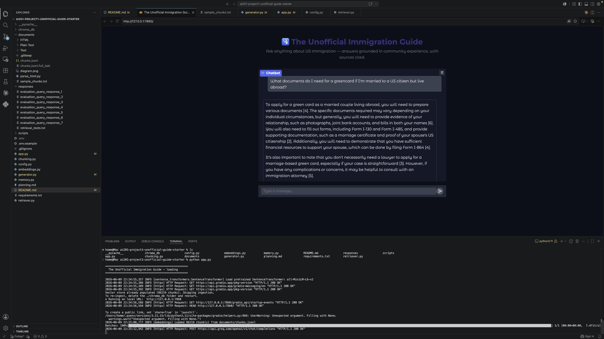

# The Unofficial Guide — Project 1

---

## Domain

US based Immigration Guide. Official channels are only meant to provide a broader guidance on immigration rules and procedures. Official channels can also be slow to respond to queries or are not easy to reach out to.

---

## Document Sources

| # | Source | Description | URL or location |
|---|--------|-------------|-----------------|
| 1 | Reddit| Subreddit of USCIS(U.S. Citizenship and Immigration Services), a federal agency overseeing lawful immigration, processes citizenship, naturalization applications etc. | https://www.reddit.com/r/USCIS/ | 
| 2 | Reddit| Subreddit that answers US Based and worldwide immigration | https://www.reddit.com/r/immigration/ | 
| 3 | Reddit| Subreddit that has news, questions, FAQs etc about H1B working visas | https://www.reddit.com/r/h1b/ | 
| 4 | Reddit| Subreddit that has news, questions, FAQs etc about F1 student visas | https://www.reddit.com/r/f1visa/ | 
| 5 | Reddit| Subreddit that has news, questions, FAQs etc about Green Cards for permanent residency| https://www.reddit.com/r/greencard/ | 
| 6 | Reddit | A Subreddit for DREAMers under Deferred Action for Childhood Arrivals (DACA) |https://www.reddit.com/r/daca/| 
| 7 | Website| FAQ section that answers questions about the latest and general US based immigration processes |https://www.murthy.com/view-all-faq/ |  
| 8 | Website| Blog that talks about latest and general US based immigration processes| https://www.ashoorilaw.com/blog/| 
| 9 | Website| Blog that talks about latest and general US based immigration processes | https://eaganimmigration.com/blog/ | 
| 10 | Website | Blog that answers basics questions about US Based immigrations |https://www.boundless.com/blog/top-us-work-visa-faqs-reddit |
---

## Chunking Strategy

**Chunk size:**

For FAQs, chunk each FAQ itself. 200 tokens
For Reddit, form post title and each comment as a chunk, and also post title and body as another chunk to provide additional information not present in the title during Retrieval.
If there are replies to the comment, only then apply token limits. Start with 200 tokens
For Blogs, chunk by paragraph first. If it's larger than 200 tokens, then split further. 

**Overlap:**

Keep 0 overlap for FAQs and Reddit.
Keep an overlap of 75 tokens for Blogs.

**Why these choices fit your documents:**

FAQs and Reddit have a natural QnA format which makes it easy for accurate retrieval when chunked together. Looking at the FAQs, they seemed to be under 200-300 words. Overlapping is not needed as each chunk already has the full context. 

One thing I observed is that Reddit has a nested and complicated structure of comments and replies. To simplify things and avoid the chunks from becoming too large and irrelevant due to replies, I decided to split the chunk further if it exceeds 200 tokens. 

Blogs on the other hand have a structured format with headings, paragraphs etc. These require larger chunks and overlap to retain continuation for more detailed queries. It seemed tempting to increase to 500-800 tokens, but thus caused the chunks to have too much information about a lot of topics. Upon looking at the blog sources, each paragraph has a lot of information on its own so that I decided overlapping would be better.

**Final chunk count:**

86219

**Sample chunks**

Link to [five sample chunks](documents/sample_chunks.txt), along with source names. 

     1. www.boundless.com_blog_top-us-work-visa-faqs-reddit.txt": {"chunk_id": "faq_view_source_https_www_boundless_com_blog_top_us_work_visa_faqs_reddit_1_0", "text": "Q: What documents do I need to prepare for a U.S. work visa application?\nA: The specific documents required depend on the type of work visa you are applying for. However, most applicants will need the following documents:\nValid passport:\nMust be valid for at least six months beyond your intended period of stay in the U.S. Job offer or employment letter:\nA letter from your U.S. employer detailing the position, salary, and job duties\nEducational credentials:\nDiplomas, degrees, or transcripts that demonstrate your qualifications for the job\nProof of work experience:\nLetters from previous employers or other documentation supporting your professional background\nResume or curriculum vitae (CV):\nHighlights your work experience and skills relevant to the position\nForm I-797 (Notice of Action)\n:\nThe receipt or approval notice sent to immigrant and nonimmigrant visa applicants to inform them that their application has been received or approved.", "metadata": {"source_type": "faq", "source": "view-source_https___www.boundless.com_blog_top-us-work-visa-faqs-reddit.txt", "title": "The Top 16 U.S. Work Visa FAQs on Reddit", "url": null, "date": null, "author": null, "extra": {"faq_number": 1, "question": "What documents do I need to prepare for a U.S. work visa application?"}, "token_estimate": 191}}
     2. Plain Text/FAQs/faq1: {"chunk_id": "faq_faq1_0", "text": "Q: Do you expect the EB5 process to get more difficult under the Trump Administration?\nA: During Trump’s first term in office, it seems his Administration was content with allowing the adjudication of EB5 cases to proceed undisturbed, for the most part. Although processing times did increase for nearly all case types, including EB5, we did not see a nationwide increase in RFEs or denials on EB5 cases, as we did for so many other types of cases. So we remain hopeful that the EB5 program will continue to operate relatively smoothly following the change in administration.", "metadata": {"source_type": "faq", "source": "Plain Text/FAQs/faq1", "title": "Do you expect the EB5 process to get more difficult under the Trump Administration?", "url": null, "date": "2025-01-01", "author": null, "extra": {"question": "Do you expect the EB5 process to get more difficult under the Trump Administration?", "faq_set": "murthy"}, "token_estimate": 126}}
     3. https://reddit.com/r/h1b: {"chunk_id": "reddit_1nlkw08_c_nf675ke_0", "text": "[Post] Those who abused H1B should be prosecuted\n[Comment] The majority of Indians?\n  > US Ivy leages sell MBA as STEM program ... close them down.\n  > Let’s not generalize them to a country. It’s an individual decision at the end of the day. I’m sure many Indians I know won’t support them even. There are many highly skilled Indians out there who are legitimate. It’s unfortunate that majority are Indians who gamed the system.\n    > 70% + of H1Bs were awarded to Indians. Those are the numbers.", "metadata": {"source_type": "reddit", "source": "r/h1b", "title": "Those who abused H1B should be prosecuted", "url": "https://reddit.com/r/h1b/comments/1nlkw08", "date": "2025-09-20T01:07:00+00:00", "author": "Think_Clerk_3284", "extra": {"post_id": "1nlkw08", "kind": "comment", "level": "comment", "parent_id": "reddit_1nlkw08_post", "comment_id": "nf675ke", "comment_author": "BoardwalkNights", "score": 3, "has_replies": true}, "token_estimate": 114}}
     4. https://reddit.com/r/h1b: {"chunk_id": "reddit_1nlkw08_c_nf67bjx_0", "text": "[Post] Those who abused H1B should be prosecuted\n[Comment] you mean (just for starters mind you)....TCS, Wipro, Infosys, Cognizant, HCL, Tech Mahindra.....etc etc etc etc.... > These consulting companies are the worst and need to be penalized for abusing the system. Their stock just plummeted as a direct result of this EO. > Which stock exactly plummeted? > Indian based companies stock plummeted when the stock market hasnt even opened yet? Stop spreading rumors. > Worth it\n    > Stock markets are closed on weekend my man\n    > They should be delisted from US stock exchanges. > What do they do that’s illegal? > Yep. Fuck em all. > TCS and Infosys absolute garbage.", "metadata": {"source_type": "reddit", "source": "r/h1b", "title": "Those who abused H1B should be prosecuted", "url": "https://reddit.com/r/h1b/comments/1nlkw08", "date": "2025-09-20T01:07:00+00:00", "author": "Think_Clerk_3284", "extra": {"post_id": "1nlkw08", "kind": "comment", "level": "comment", "parent_id": "reddit_1nlkw08_post", "comment_id": "nf67bjx", "comment_author": "CapitalTop9246", "score": 483, "has_replies": true}, "token_estimate": 146}}
     5. https://reddit.com/r/h1b: {"chunk_id": "reddit_1nlkw08_c_nf67bjx_1", "text": "> State street bank in Boston is facing a reckoning\n  > I have worked at one of these WITCH companies and if anything these guys actually run proper companies, pay taxes and salaries and try to stay right on the legal side because they are a listed company and a brand. The real culprits are the hundreds of no-name consultancies that subcontract to these big firms and other vendors. They break every rule and make millions for just being the middle man - no HR, no benefits, fake payslips, proxy interviews, fake resumes, same guy working for multiple clients. The WITCH companies get noticed because they are big", "metadata": {"source_type": "reddit", "source": "r/h1b", "title": "Those who abused H1B should be prosecuted", "url": "https://reddit.com/r/h1b/comments/1nlkw08", "date": "2025-09-20T01:07:00+00:00", "author": "Think_Clerk_3284", "extra": {"post_id": "1nlkw08", "kind": "comment", "level": "comment", "parent_id": "reddit_1nlkw08_post", "comment_id": "nf67bjx", "comment_author": "CapitalTop9246", "score": 483, "has_replies": true}, "token_estimate": 140}}`

---

## Embedding Model

**Model used:**
all-MiniLM-L6-v2

**Production tradeoff reflection:**

Support for Spanish, Chinese, Hindi based documents.
Different embeddng model that can reflect immigration language and dictionary.
Benchmarking different models local and hosted to check latency and other NLP related parameters.

**Retrieval Approach**

Semantic search, BM25 keyword and hybrid search combining the both. The Hybrid apporach uses 
Rank Reciprocal Fusion to provide a centralized score and equal weight for both. This works by
taking the reciprocal of the distance and bm25 scores which also have a constant factor added to them to prevent extreme values from affecting the final rank.

Use metadata filtering on queries as well. Display distance score, chunks retrieved, metadata included for K=5.

**Sample Retrievals**

For details on metrics and runs, refer to [Sample Retrievals and Metrics](responses/retrieval_tests.txt). 

     Running 3 eval question(s) at top-k=5

     ================================================================================
     SEMANTIC SEARCH: 
     ================================================================================

     ================================================================================
     Query: What documents do I need for a greencard application if I am married to a US citizen but I live outside of the US?
     ================================================================================
     RRF:  distance=0.2865  bm25=—
     source=r/greencard  source_type=reddit  level=comment
     title=Green card process
     url=https://reddit.com/r/greencard/comments/1slsj5g
     text: [Post] Green card process [Comment] For a typical case where your spouse is in the U.S., the steps are: File Form I-130 (to prove the marriage is real) File Form I-485 (green card application) Include supporting forms like I-864 (financial support) and I-693 (medical exam), plus …
     ↳ post context: [Post] Green card process Hi! My husband and I are attempting to get him a green card through marriage. We have a general idea of what to do but are kind of getting overwhelmed. What are the steps and…
     RRF:  distance=0.3032  bm25=—
     source=r/greencard  source_type=reddit  level=comment
     title=Green card through marriage. We don’t live in the States.
     url=https://reddit.com/r/greencard/comments/1rujhzx
     text: [Post] Green card through marriage. We don’t live in the States. [Comment] You need to have either US income or US assets to sponsor the affidavit of support. The requirements for each are here: https://www.uscis.gov/i-864p As long as you have the required income or assets, or yo…
     ↳ post context: [Post] Green card through marriage. We don’t live in the States. So we’re married already 10 years, we have a 11 y/o. We don’t live in the states (have never lived together there). Our marriage is reg…
     RRF:  distance=0.3126  bm25=—
     source=r/greencard  source_type=reddit  level=comment
     title=Green card visa lawyer required or not???
     url=https://reddit.com/r/greencard/comments/1qe0w2j
     text: [Post] Green card visa lawyer required or not??? [Comment] Not required unless there are complications (immigration related offense, previous marriage, etc.). Lots of resources to guide you through filling the forms and whatever documents you need.
     ↳ post context: [Post] Green card visa lawyer required or not??? I just got married and my husband is Irish. We are looking to apply for the green card for him. Lawyers are crazy expensive and wondering if a lawyer i…
     RRF:  distance=0.3141  bm25=—
     source=r/greencard  source_type=reddit  level=comment
     title=Visas, Green Cards, and H-1B... AMA!
     url=https://reddit.com/r/greencard/comments/1npegui
     text: [Post] Visas, Green Cards, and H-1B... AMA! [Comment] What documents need to be prepared and brought to the marriage-based Greencard interview? Why doesn't USCIS just tell the couple a list of the documents needed prior the interview? > There is no one-size-fits-all list of docum…
     ↳ post context: [Post] Visas, Green Cards, and H-1B... AMA! https://preview.redd.it/6m8xtu8in4rf1.jpg?width=4284&format=pjpg&auto=webp&s=fa362b38e371b87785848e143bd10002be222669 I’m Henry Lindpere, an immigration att…
     RRF:  distance=0.3151  bm25=—
     source=r/immigration  source_type=reddit  level=comment
     title=Marriage based green card
     url=https://reddit.com/r/immigration/comments/1lp4tvw
     text: [Post] Marriage based green card [Comment] They are pretty simple for me. If you read the form instructions and read through a couple of hundred pages of the policy manual (Google for it), you cannot DIY. Yours is the most cookie cutter case. Anything beyond USCIS filing fees is …
     ↳ post context: [Post] Marriage based green card We were quoted $8,500 for filing plus $3,500 attorney fees in Bay Area, California. Does that seem reasonable? Spouse is already in the U.S. on a valid working visa. F…

     ================================================================================
     BM25 KEYWORD SEARCH: 
     ================================================================================

     ================================================================================
     Query: What documents do I need for a greencard application if I am married to a US citizen but I live outside of the US?
     ================================================================================
     RRF:  distance=—  bm25=51.882
     source=r/greencard  source_type=reddit  level=post
     title=Had to go to back to Germany for a family emergency now I want to go back to the US but dont have my greencard?
     url=https://reddit.com/r/greencard/comments/1l7ocyt
     text: [Post] Had to go to back to Germany for a family emergency now I want to go back to the US but dont have my greencard? Hey I live in the US as a LPR and recently had to fly to Germany for a family emergency. My greencard is lost. Do I need to go to the closest consulate to get a …
     RRF:  distance=—  bm25=51.524
     source=r/greencard  source_type=reddit  level=comment
     title=US citizen married to Japanese citizen (US greencard holder). Contemplating giving up US green card
     url=https://reddit.com/r/greencard/comments/1r2c0y5
     text: [Post] US citizen married to Japanese citizen (US greencard holder). Contemplating giving up US green card [Comment] Maybe keep it and do Guam runs until you figure out your situation. For context my wife is a GC holder and we do NY and Guam runs when we leave the country for lon…
     RRF:  distance=—  bm25=51.430
     source=r/greencard  source_type=reddit  level=comment
     title=Green Card Holders living outside the US?
     url=https://reddit.com/r/greencard/comments/1q92v88
     text: [Post] Green Card Holders living outside the US? [Comment] A green card is for a US **permanent resident**. A person living outside the US doesn't need a green card, do they? > I agree! Why get a green card (which is so difficult) if a person plans to live outside the US? > I get…
     RRF:  distance=—  bm25=51.226
     source=r/greencard  source_type=reddit  level=comment
     title=US citizen married to Japanese citizen (US greencard holder). Contemplating giving up US green card
     url=https://reddit.com/r/greencard/comments/1r2c0y5
     text: [Post] US citizen married to Japanese citizen (US greencard holder). Contemplating giving up US green card [Comment] I’m a green holder (not Japanese) who’s considering leaving. I believe there’s a form you need to fill out to surrender your gc when you file your taxes for 2026. …
     RRF:  distance=—  bm25=51.216
     source=r/greencard  source_type=reddit  level=comment
     title=Any one here who had given up their greencard? Do you regret it or not at all?
     url=https://reddit.com/r/greencard/comments/1sgtfm6
     text: [Post] Any one here who had given up their greencard? Do you regret it or not at all? [Comment] Yes, I did. I lived in the US for years on a greencard but I really wasn’t happy there. I moved back home 2 years ago and gave up my greencard. It was the best decision for me and I am…

     ================================================================================
     HYBRID SEARCH: 
     ================================================================================

     ================================================================================
     Query: What documents do I need for a greencard application if I am married to a US citizen but I live outside of the US?
     ================================================================================
     RRF: 0.02 distance=0.2865  bm25=—
     source=r/greencard  source_type=reddit  level=comment
     title=Green card process
     url=https://reddit.com/r/greencard/comments/1slsj5g
     text: [Post] Green card process [Comment] For a typical case where your spouse is in the U.S., the steps are: File Form I-130 (to prove the marriage is real) File Form I-485 (green card application) Include supporting forms like I-864 (financial support) and I-693 (medical exam), plus …
     ↳ post context: [Post] Green card process Hi! My husband and I are attempting to get him a green card through marriage. We have a general idea of what to do but are kind of getting overwhelmed. What are the steps and…
     RRF: 0.02 distance=—  bm25=51.882
     source=r/greencard  source_type=reddit  level=post
     title=Had to go to back to Germany for a family emergency now I want to go back to the US but dont have my greencard?
     url=https://reddit.com/r/greencard/comments/1l7ocyt
     text: [Post] Had to go to back to Germany for a family emergency now I want to go back to the US but dont have my greencard? Hey I live in the US as a LPR and recently had to fly to Germany for a family emergency. My greencard is lost. Do I need to go to the closest consulate to get a …
     RRF: 0.02 distance=0.3032  bm25=—
     source=r/greencard  source_type=reddit  level=comment
     title=Green card through marriage. We don’t live in the States.
     url=https://reddit.com/r/greencard/comments/1rujhzx
     text: [Post] Green card through marriage. We don’t live in the States. [Comment] You need to have either US income or US assets to sponsor the affidavit of support. The requirements for each are here: https://www.uscis.gov/i-864p As long as you have the required income or assets, or yo…
     ↳ post context: [Post] Green card through marriage. We don’t live in the States. So we’re married already 10 years, we have a 11 y/o. We don’t live in the states (have never lived together there). Our marriage is reg…
     RRF: 0.02 distance=—  bm25=51.524
     source=r/greencard  source_type=reddit  level=comment
     title=US citizen married to Japanese citizen (US greencard holder). Contemplating giving up US green card
     url=https://reddit.com/r/greencard/comments/1r2c0y5
     text: [Post] US citizen married to Japanese citizen (US greencard holder). Contemplating giving up US green card [Comment] Maybe keep it and do Guam runs until you figure out your situation. For context my wife is a GC holder and we do NY and Guam runs when we leave the country for lon…
     RRF: 0.02 distance=0.3126  bm25=—
     source=r/greencard  source_type=reddit  level=comment
     title=Green card visa lawyer required or not???
     url=https://reddit.com/r/greencard/comments/1qe0w2j
     text: [Post] Green card visa lawyer required or not??? [Comment] Not required unless there are complications (immigration related offense, previous marriage, etc.). Lots of resources to guide you through filling the forms and whatever documents you need.
     ↳ post context: [Post] Green card visa lawyer required or not??? I just got married and my husband is Irish. We are looking to apply for the green card for him. Lawyers are crazy expensive and wondering if a lawyer i…

     ================================================================================
     SEMANTIC SEARCH: 
     ================================================================================

     ================================================================================
     Query: How long does premium processing take for J1 visas and how much does it cost?
     ================================================================================
     RRF:  distance=0.3422  bm25=—
     source=USCIS Premium Processing Cost & Benefits _ Ashoori Law.txt  source_type=blog
     title=USCIS Premium Processing: Is it Worth it?
     url=None
     text: For instance, if the standard processing time for an L1 Visa petition is six months, utilizing premium processing involves paying an extra fee, currently set at $2,500, to have the case reviewed within just 15 days. A New Angle on Premium Processing While the expedited processing…
     RRF:  distance=0.3497  bm25=—
     source=r/h1b  source_type=reddit  level=comment
     title=Pay for H1B Premium Processing out of pocket?
     url=https://reddit.com/r/h1b/comments/1l52ann
     text: [Post] Pay for H1B Premium Processing out of pocket? [Comment] Regular takes 4-6 months. There is no guarantee it will be approved by Oct 1 so if it's filed COS and you want it effective Oct 1, then do premium. If it will require consular processing, then it shouldn't matter sinc…
     ↳ post context: [Post] Pay for H1B Premium Processing out of pocket? I just got the lottery win for H1B this year, but as per my company's policy they only will submit the petition under regular processing. They do a…
     RRF:  distance=0.3586  bm25=—
     source=r/f1visa  source_type=reddit  level=post
     title=OPT Application and Premium Processing Fee Update and Advice Sep 2025.
     url=https://reddit.com/r/f1visa/comments/1numnq9
     text: [Post] OPT Application and Premium Processing Fee Update and Advice Sep 2025. I received the completed i20 doc with recommendation within 3h of the call. Lesson: Be polite but pushy, always follow up, follow up many times. Make them want to process your file faster so you stop fo…
     RRF:  distance=0.3596  bm25=—
     source=r/h1b  source_type=reddit  level=comment
     title=Pay for H1B Premium Processing out of pocket?
     url=https://reddit.com/r/h1b/comments/1l52ann
     text: [Post] Pay for H1B Premium Processing out of pocket? [Comment] If you have enough time to have a valid visa till the approval comes then you can have regular processing and also the scenario if you don’t have a travel planned anytime soon But if you have a dilemma with the status…
     ↳ post context: [Post] Pay for H1B Premium Processing out of pocket? I just got the lottery win for H1B this year, but as per my company's policy they only will submit the petition under regular processing. They do a…
     RRF:  distance=0.3698  bm25=—
     source=r/h1b  source_type=reddit  level=comment
     title=H1B pending
     url=https://reddit.com/r/h1b/comments/1o3ai5t
     text: [Post] H1B pending [Comment] Hang in there, it takes time without premium. 3.5 months is mentioned on their website. > 7.5 months - from USCIS website. Anyone can check it. It used to be 3.5 months earlier this year, but since summer processing times went down.
     ↳ post context: [Post] H1B pending Got picked in 2025 lottery and my employer applied by the end of June. There hasn’t been any update. Standard processing. How long can I expect approval to take? Any instances where…

     ================================================================================
     BM25 KEYWORD SEARCH: 
     ================================================================================

     ================================================================================
     Query: How long does premium processing take for J1 visas and how much does it cost?
     ================================================================================
     RRF:  distance=—  bm25=38.958
     source=r/f1visa  source_type=reddit  level=comment
     title=To premium process or not….
     url=https://reddit.com/r/f1visa/comments/1mt1289
     text: [Post] To premium process or not…. [Comment] I don’t think it’s too late. I paid for PP on 8/11 and got approved on 8/16. > How much does that cost?? > Did you do premium Processing for f1 reinstatement? > hey when was your card produces after it was approved
     RRF:  distance=—  bm25=36.915
     source=r/f1visa  source_type=reddit  level=comment
     title=Defer enrollment
     url=https://reddit.com/r/f1visa/comments/1lclav0
     text: [Post] Defer enrollment [Comment] On average, how long does it take to process the F1? For J1, I know it takes 5-7 business days and B1/B2 up to 3-4 weeks but for F1? > 3-5 days for F1 typically
     RRF:  distance=—  bm25=35.715
     source=r/USCIS  source_type=reddit  level=post
     title=I-765 Timeline - Approval Case Decision Rendered
     url=https://reddit.com/r/USCIS/comments/1lvnlkd
     text: [Post] I-765 Timeline - Approval Case Decision Rendered Hello! Does anyone know how long does it take to receive the official notice and additionally how long does it take for EAD to arrive?
     RRF:  distance=—  bm25=35.431
     source=r/USCIS  source_type=reddit  level=post
     title=Green card letter extension
     url=https://reddit.com/r/USCIS/comments/1lfugt7
     text: [Post] Green card letter extension Hi how what is the cost for a letter extension and how long does this process take?
     RRF:  distance=—  bm25=33.006
     source=r/greencard  source_type=reddit  level=comment
     title=Immigration Attorney AMA about Employment-Based Green Cards!
     url=https://reddit.com/r/greencard/comments/1r83mrz
     text: [Post] Immigration Attorney AMA about Employment-Based Green Cards! [Comment] Hi, how long does the entire EB-2 GC process take if I opt for premium processing and I am not from the countries with huge backlogs?

     ================================================================================
     HYBRID SEARCH: 
     ================================================================================

     ================================================================================
     Query: How long does premium processing take for J1 visas and how much does it cost?
     ================================================================================
     RRF: 0.03 distance=0.3882  bm25=33.006
     source=r/greencard  source_type=reddit  level=comment
     title=Immigration Attorney AMA about Employment-Based Green Cards!
     url=https://reddit.com/r/greencard/comments/1r83mrz
     text: [Post] Immigration Attorney AMA about Employment-Based Green Cards! [Comment] Hi, how long does the entire EB-2 GC process take if I opt for premium processing and I am not from the countries with huge backlogs?
     ↳ post context: [Post] Immigration Attorney AMA about Employment-Based Green Cards! Hey everyone! I’m David Santiago, Senior Immigration Counsel at Manifest Law, and I’m hosting an AMA focused on all Employment-Based…
     ↳ post context: [Post] Immigration Attorney AMA about Employment-Based Green Cards! Participating does not create an attorney–client relationship. For advice about your specific case, consult your own immigration att…
     RRF: 0.03 distance=0.3888  bm25=31.147
     source=r/h1b  source_type=reddit  level=post
     title=H1B premium Processing
     url=https://reddit.com/r/h1b/comments/1lk5j1u
     text: [Post] H1B premium Processing I recently filed for H1B transfer petition with new employer with premium processing. Anyone else didn’t recently? How long did it take?
     RRF: 0.03 distance=0.4041  bm25=32.707
     source=r/h1b  source_type=reddit  level=post
     title=California Premium Processing Timeline
     url=https://reddit.com/r/h1b/comments/1m5ocq5
     text: [Post] California Premium Processing Timeline Good morning, I submitted my h1b application on Jun 16th and it is currently in progress at the California processing center. I know it is supposed to be processed with in 15 days; but does anyone have a datapoint on how long it takes…
     RRF: 0.02 distance=0.3422  bm25=—
     source=USCIS Premium Processing Cost & Benefits _ Ashoori Law.txt  source_type=blog
     title=USCIS Premium Processing: Is it Worth it?
     url=None
     text: For instance, if the standard processing time for an L1 Visa petition is six months, utilizing premium processing involves paying an extra fee, currently set at $2,500, to have the case reviewed within just 15 days. A New Angle on Premium Processing While the expedited processing…
     RRF: 0.02 distance=—  bm25=38.958
     source=r/f1visa  source_type=reddit  level=comment
     title=To premium process or not….
     url=https://reddit.com/r/f1visa/comments/1mt1289
     text: [Post] To premium process or not…. [Comment] I don’t think it’s too late. I paid for PP on 8/11 and got approved on 8/16. > How much does that cost?? > Did you do premium Processing for f1 reinstatement? > hey when was your card produces after it was approved

     ================================================================================
     SEMANTIC SEARCH: 
     ================================================================================

     ================================================================================
     Query: How do I know if I will be eligible for H1B lottery in 2026 under Masters degree quota in STEM?
     ================================================================================
     RRF:  distance=0.2384  bm25=—
     source=r/f1visa  source_type=reddit  level=comment
     title=What if I can not participate in the first round of H1B due to graduating late (STEM OPT)?
     url=https://reddit.com/r/f1visa/comments/1opn5pu
     text: [Post] What if I can not participate in the first round of H1B due to graduating late (STEM OPT)? [Comment] 1. Since you already have a bachelor’s, you can definitely enter the lottery, and if picked, start H-1B status October 1. 2. As long as you have the master’s by the time yo…
     ↳ post context: [Post] What if I can not participate in the first round of H1B due to graduating late (STEM OPT)? Hi Everyone, So, I'm in a weird situation. My professor is urging me to defend my thesis in December b…
     ↳ post context: [Post] What if I can not participate in the first round of H1B due to graduating late (STEM OPT)? Now, what I want to know is, as they will not be able to do the first round for me (I am in STEM field…
     RRF:  distance=0.2537  bm25=—
     source=r/f1visa  source_type=reddit  level=comment
     title=What if I can not participate in the first round of H1B due to graduating late (STEM OPT)?
     url=https://reddit.com/r/f1visa/comments/1opn5pu
     text: [Post] What if I can not participate in the first round of H1B due to graduating late (STEM OPT)? [Comment] OPT STEM requires you to complete the degree before entering the lottery. You won't be able to do it this year > I will be on OPT in 2026. So, in January 2027 will be on ST…
     ↳ post context: [Post] What if I can not participate in the first round of H1B due to graduating late (STEM OPT)? Hi Everyone, So, I'm in a weird situation. My professor is urging me to defend my thesis in December b…
     ↳ post context: [Post] What if I can not participate in the first round of H1B due to graduating late (STEM OPT)? Now, what I want to know is, as they will not be able to do the first round for me (I am in STEM field…
     RRF:  distance=0.3090  bm25=—
     source=r/f1visa  source_type=reddit  level=post
     title=What if I can not participate in the first round of H1B due to graduating late (STEM OPT)?
     url=https://reddit.com/r/f1visa/comments/1opn5pu
     text: [Post] What if I can not participate in the first round of H1B due to graduating late (STEM OPT)? Now, what I want to know is, as they will not be able to do the first round for me (I am in STEM field, so will have additional two years for OPT hopefully), will there be any conseq…
     RRF:  distance=0.3097  bm25=—
     source=r/h1b  source_type=reddit  level=post
     title=so there's a chance that there won't be h1b lottery next year?
     url=https://reddit.com/r/h1b/comments/1nnzh0n
     text: [Post] so there's a chance that there won't be h1b lottery next year? every h1b applicant next year will probably just get an h1b automatically?
     RRF:  distance=0.3212  bm25=—
     source=r/f1visa  source_type=reddit  level=comment
     title=Would this work after graduation….OPT?
     url=https://reddit.com/r/f1visa/comments/1nhbk66
     text: [Post] Would this work after graduation….OPT? [Comment] 1, you are only allowed to apply opt in 90 days before your program end day(not equal to graduation/ceremony) on you i20, and you must ask your DSO for recommendation and sign on a new i20 before application. 2, as other pos…
     ↳ post context: [Post] Would this work after graduation….OPT? I’m trying to plan ahead for what to do after graduation. I got an internship during my junior year, and they’re willing to sponsor me. Right now, I’m stu…

     ================================================================================
     BM25 KEYWORD SEARCH: 
     ================================================================================

     ================================================================================
     Query: How do I know if I will be eligible for H1B lottery in 2026 under Masters degree quota in STEM?
     ================================================================================
     RRF:  distance=—  bm25=46.367
     source=r/f1visa  source_type=reddit  level=comment
     title=What if I can not participate in the first round of H1B due to graduating late (STEM OPT)?
     url=https://reddit.com/r/f1visa/comments/1opn5pu
     text: [Post] What if I can not participate in the first round of H1B due to graduating late (STEM OPT)? [Comment] OPT STEM requires you to complete the degree before entering the lottery. You won't be able to do it this year > I will be on OPT in 2026. So, in January 2027 will be on ST…
     RRF:  distance=—  bm25=41.500
     source=r/f1visa  source_type=reddit  level=post
     title=What if I can not participate in the first round of H1B due to graduating late (STEM OPT)?
     url=https://reddit.com/r/f1visa/comments/1opn5pu
     text: [Post] What if I can not participate in the first round of H1B due to graduating late (STEM OPT)? Now, what I want to know is, as they will not be able to do the first round for me (I am in STEM field, so will have additional two years for OPT hopefully), will there be any conseq…
     RRF:  distance=—  bm25=41.042
     source=r/f1visa  source_type=reddit  level=post
     title=Has my chances for H1B visa increased or has it become worse
     url=https://reddit.com/r/f1visa/comments/1q6367b
     text: [Post] Has my chances for H1B visa increased or has it become worse I saw the new wage based H1b visa rule. I’m wanting to understand if my chances have increased or decreased. Background- Have a bachelors degree non stem, work at a big 4 as an auditor in one of a major metropoli…
     RRF:  distance=—  bm25=40.436
     source=r/h1b  source_type=reddit  level=post
     title=H1B after 6 years
     url=https://reddit.com/r/h1b/comments/1n808os
     text: [Post] H1B after 6 years My 6 years of H-1B status will expire in December 2025. My green card process was started about 5 months ago, and I am still in the PWD stage. I do not expect my I-140 to be approved for another 2 years. If I leave the United States in September 2025, wil…
     RRF:  distance=—  bm25=40.415
     source=r/f1visa  source_type=reddit  level=post
     title=How does the new H1B proclamation affect STEM OPT holders?
     url=https://reddit.com/r/f1visa/comments/1nlsv17
     text: [Post] How does the new H1B proclamation affect STEM OPT holders? Does anyone know if STEM OPT people will be affected by the new H1B proclamation? From what I read it seems like the 100k fee is only applicable if a company files a petition for someone outside the US? For people …

     ================================================================================
     HYBRID SEARCH: 
     ================================================================================

     ================================================================================
     Query: How do I know if I will be eligible for H1B lottery in 2026 under Masters degree quota in STEM?
     ================================================================================
     RRF: 0.03 distance=0.2537  bm25=46.367
     source=r/f1visa  source_type=reddit  level=comment
     title=What if I can not participate in the first round of H1B due to graduating late (STEM OPT)?
     url=https://reddit.com/r/f1visa/comments/1opn5pu
     text: [Post] What if I can not participate in the first round of H1B due to graduating late (STEM OPT)? [Comment] OPT STEM requires you to complete the degree before entering the lottery. You won't be able to do it this year > I will be on OPT in 2026. So, in January 2027 will be on ST…
     ↳ post context: [Post] What if I can not participate in the first round of H1B due to graduating late (STEM OPT)? Hi Everyone, So, I'm in a weird situation. My professor is urging me to defend my thesis in December b…
     ↳ post context: [Post] What if I can not participate in the first round of H1B due to graduating late (STEM OPT)? Now, what I want to know is, as they will not be able to do the first round for me (I am in STEM field…
     RRF: 0.03 distance=0.3090  bm25=41.500
     source=r/f1visa  source_type=reddit  level=post
     title=What if I can not participate in the first round of H1B due to graduating late (STEM OPT)?
     url=https://reddit.com/r/f1visa/comments/1opn5pu
     text: [Post] What if I can not participate in the first round of H1B due to graduating late (STEM OPT)? Now, what I want to know is, as they will not be able to do the first round for me (I am in STEM field, so will have additional two years for OPT hopefully), will there be any conseq…
     RRF: 0.02 distance=0.2384  bm25=—
     source=r/f1visa  source_type=reddit  level=comment
     title=What if I can not participate in the first round of H1B due to graduating late (STEM OPT)?
     url=https://reddit.com/r/f1visa/comments/1opn5pu
     text: [Post] What if I can not participate in the first round of H1B due to graduating late (STEM OPT)? [Comment] 1. Since you already have a bachelor’s, you can definitely enter the lottery, and if picked, start H-1B status October 1. 2. As long as you have the master’s by the time yo…
     ↳ post context: [Post] What if I can not participate in the first round of H1B due to graduating late (STEM OPT)? Hi Everyone, So, I'm in a weird situation. My professor is urging me to defend my thesis in December b…
     ↳ post context: [Post] What if I can not participate in the first round of H1B due to graduating late (STEM OPT)? Now, what I want to know is, as they will not be able to do the first round for me (I am in STEM field…
     RRF: 0.02 distance=—  bm25=41.042
     source=r/f1visa  source_type=reddit  level=post
     title=Has my chances for H1B visa increased or has it become worse
     url=https://reddit.com/r/f1visa/comments/1q6367b
     text: [Post] Has my chances for H1B visa increased or has it become worse I saw the new wage based H1b visa rule. I’m wanting to understand if my chances have increased or decreased. Background- Have a bachelors degree non stem, work at a big 4 as an auditor in one of a major metropoli…
     RRF: 0.02 distance=0.3097  bm25=—
     source=r/h1b  source_type=reddit  level=post
     title=so there's a chance that there won't be h1b lottery next year?
     url=https://reddit.com/r/h1b/comments/1nnzh0n
     text: [Post] so there's a chance that there won't be h1b lottery next year? every h1b applicant next year will probably just get an h1b automatically?

Summary:

The tests on the 3 queries were done with all the methods above and based on the results semantic search worked the best. BM25 did not work as well as semantic search, hence hybrid search didn't as well. My hypothesis is that BM25 could work well if there are very specific keywords or jargon that one is looking for. The nature of the queries are such that there are a lot of filler keywords and non specific words that can match unrelated sources, especially for a Reddit corpus as large as what was scrapped here. 

For all three queries, the distance scores were under 0.5

For for the query `How do I know if I will be eligible for H1B lottery in 2026 under Masters degree quota in STEM?`: The distance score is 0.3, and the chunks mostly talk about H1B lottery eligibility, interestingly the chunks come from r/f1visa as it seems like this question comes up more frequently for folks with an F1 visa as they enter the lottery.

The distance scores however were were higher for `How long does premium processing take for J1 visas and how much does it cost?`, around 0.4 and the chunks reflect this as they talk about premium processing for other visa types but not J1.

---

## Grounded Generation

**System prompt grounding instruction:**

     You are The Unofficial Immigration Guide, an assistant that answers questions about US \
     immigration using ONLY the context sources provided by the user.

     Rules:
     - Base every claim strictly on the context sources. Do not use outside knowledge.
     - Cite the sources you used inline with bracketed numbers, e.g. [1], [2]. 
     - If the context does not contain enough information to answer, say so plainly \
     and do not guess. Do not fabricate citations.
     - If the question is outside US immigration or unrelated to the context, say it \
     is outside the scope of this guide. Do not cite any sources.
     - The context is drawn from forums and community posts (Reddit, FAQs, blogs), \
     so it may be anecdotal — note when guidance reflects user experience rather \
     than official rules, and remind the user to verify with official USCIS sources \
     for anything time-sensitive.
     - Be concise and direct. Answer in plain language.\

    For cases with no relevant chunks retrieved:
     "I couldn't find anything relevant in the guide.
     "Try rephrasing your question."

**How source attribution is surfaced in the response:**

Source attribution is ensured at the prompt level, but with additional instructions on when to show the full set of references.
(My tests showed that it gave references for irrelevant or out of scope questions.)

---

## Evaluation Report

**How to generate responses**

1. Fork or clone the repository.
2. Run `python app.py` on your CLI. 
3. The Gradio interface launches, with an interface that gives you examples of questions you can ask.
4. Enter the query and press Enter. The interface provides an answer, with sources cited right after the response.

Below are the questions tested against the system:

| # | Question | Expected answer | System response (summarized) | Retrieval quality | Response accuracy |
|---|----------|-----------------|------------------------------|-------------------|-------------------|
| 1 | What documents do I need for a greencard application if I am married to a us citizen but I live outside of the US? | If you live outside the U.S. and are married to a U.S. citizen, you must use Consular Processing. This requires filing ⁠Form I-130 and applying for an immigrant visa through the ⁠DS-260. You will need civil documents, financial evidence, proof of a genuine marriage, and medical/police records|[ Link](/responses/evaluation_query_response_1) | Relevant| Accurate |
| 2 | How long does premium processing take for J1 visas and how much does it cost?| Premium processing for J-1 visa applicants changing or extending their nonimmigrant status within the U.S. takes 30 calendar days and costs \(\$2,075\). This expedited service is requested using ⁠Form I-907, Request for Premium Processing Service alongside Form I-539, Application to Extend/Change Nonimmigrant Status | [Link](/responses/evaluation_query_response_2) | Partially relevant |  Partially accurate|
| 3 | How do I know if I will be eligible for H1B lottery in 2026 under Masters degree quota in STEM?| USCIS has shifted to a wage-based selection system which can directly impact your odds. If your employer offers a role that aligns with a higher Department of Labor (DOL) prevailing wage level (Level III or Level IV) and you hold a U.S. Master's degree, your registration can receive compounded entries, heavily favoring your selection in the lottery before going to the Master's cap pool | [Link](/responses/evaluation_query_response_3) |Partially Relevant | Partially Accurate |
| 4 | I did not receive my EAD card I applied for under H4 visa. USCIS portal shows that it's mailed. What do I do?| Find the tracking number in your USCIS Account under your H-4 EAD case status.If it says Delivered, check your mailroom, front desk, or neighbors. If still missing, immediately contact your local post office to request a Missing Mail Search. If it says Undeliverable/Returned to Sender, the card is likely heading back to USCIS.  Wait at least 7 business days (but no more than 90 days) after the mailing date before contacting them. Submit a Non-Delivery of Card request using the erequest tool. | [Link](/responses/evaluation_query_response_4)| Relevant| Accurate |
| 5 | I got rejected in my F1 Visa application and I have classes coming up in a month? How do I reapply with this in mind?| With classes starting in a month, you can reapply immediately, but you must first address the reason for your denial. To salvage your upcoming semester, you need to fix any application flaws, secure a new I-20 with an updated start date, and request an expedited interview. | [Link](/responses/evaluation_query_response_5) | Relevant | Accurate |
| 6 | (Out of scope) How do I apply for Schengen Visa? | (Systems says it cannot give any information as it's not related to US immigration) |[Link](/responses/evaluation_query_response_6)  | Off-target | Accurate |
| 7 | (Out of scope)What is the weather? |(Systems says it cannot give any information as it's not related to US immigration) |[Link](/responses/evaluation_query_response_7)  | Relevant | Accurate |

**Retrieval quality:** Relevant / Partially relevant / Off-target  
**Response accuracy:** Accurate / Partially accurate / Inaccurate

---

## Failure Case Analysis

**Question that failed:**

Q1.How long does premium processing take for J1 visas and how much does it cost?
Q3.How do I know if I will be eligible for H1B lottery in 2026 under Masters degree quota in STEM?
Q6.How do I apply for Schengen Visa?

**What the system returned:**

A1:[Link](/responses/evaluation_query_response_1)
A3:[Link](/responses/evaluation_query_response_3)
A6:[Link](/responses/evaluation_query_response_6)

**Root cause (tied to a specific pipeline stage):**

Q1.The actual data about premium processing was available, but for J1 visa it was unable to find any specific information because there were less references to it.

Q3: The souurces refer to the latest changes in the H1B based lottery cited, but at the Generation stage the model missed using that piece of information.

Q6. Some of the information about non US immigration slipped through in the Ingestion Pipeline, despite filters to catch any non US data. In this instance, the model though the prompt identified it and was able to provide a grounded response.

**What you would change to fix it:**

I would like to rebalance the datasets collected and improve filters to prevent irrelevant information from showing up. 
(Reddit alone has around ~8000 posts and 20,000 comments compared to Blogs and FAQs that were under 200 documents!)
I also would dig into why the model failed to use the relevant chunks to cite an answer. My guess is that it has something to do with the temperature settings, but I did not get a chance to explore.

---

## Spec Reflection

**One way the spec helped you during implementation:**
It helped me to debug and understand what each stage of the RAG pipeline should look like, which saved hours of figuring that out. E.g inspecting the chunks, retrieval metrics etc.

**One way your implementation diverged from the spec, and why:**

In my implementation, I asked Claude Code to help me outline the skeletal code of each stage so that I could get a better picture of the whole flow, otherwise it felt like a black box for me.
Additionally I iterated through the data collection, chunking and ingestion stages multiple times as some of the initial datasets collected were tedious or impossible to scrap and it helped me to scope down my data.

---

## AI Usage

**Instance 1**

- *What I gave the AI:*
Documents collected under `documents`, `Document sources` and `Chunking` in `planning.md` for loading Reddit Data from Arctic Shift(API that gets historical data through periodic dumps).
- *What it produced:*
It produced `ingest.py`, `parse_html.py` and `chunking.py`
- *What I changed or overrode:*
For `ingest.py` I noticed rate limit issues and lots of time taken to load posts and comments. 

I asked it to add rate limits in `get_comments()` and also use Thread executors for loading posts in `scrape_immigration_posts`. I also tried concurrency for `get_comments` but the server was getting rate limited very quickly so I modifed the number of workers from 16 that was generated to 5 to reduce some of the issues.

For `chunking.py`, I modified the token counts from 100 to 200 after checking some chunks. Also I asked Claude Code to remove deleted or redacted posts and comments for Reddit data along with ensuring it had a score > 1 to remove as much noise as possible.

**Instance 2**

- *What I gave the AI:*
`Retrieval Approach` from `planning.md` along with `chunking.py` to produce the Retrieval and Generation code.
- *What it produced:*
`retriever.py`, `embeddings.py`, `generator.py`, `app.py`
- *What I changed or overrode:*
In `embeddings.py`, I changed the batch size to be the maximum batch size: 5461 to speed up the index building process.

In `retriever.py`, Claude Code generated results for the hybrid retrieval only. I modified the `test_retriever` function to add both bm25 keyword search and semantic search.

