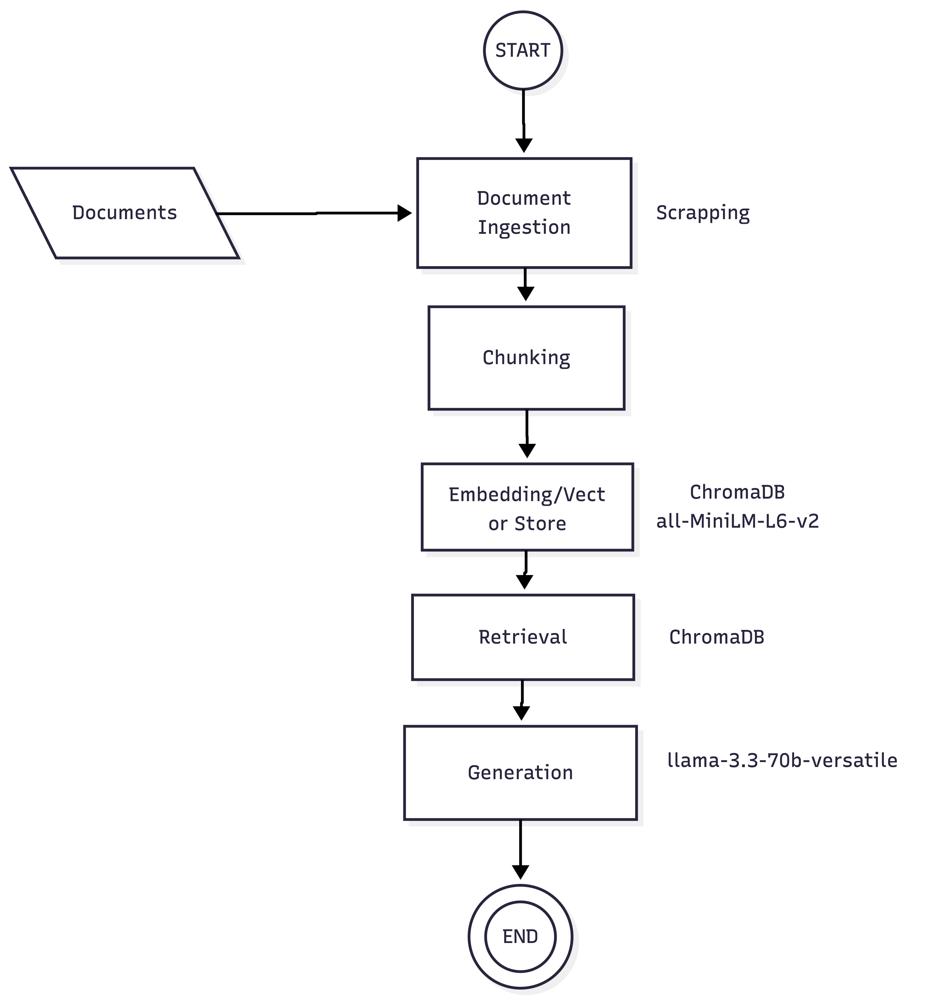

# Project 1 Planning: The Unofficial Guide

> Write this document before you write any pipeline code.
> Your spec and architecture diagram are what you'll use to direct AI tools (Claude, Copilot, etc.) to generate your implementation — the more specific they are, the more useful the generated code will be.
> Update the Retrieval Approach and Chunking Strategy sections if you change your approach during implementation.
> Update this file before starting any stretch features.

---

## Domain

<!-- What domain did you choose? Why is this knowledge valuable and hard to find through official channels? -->

US based Immigration Guide. Official channels are only meant to provide a broader guidance on immigration rules and procedures. Official channels can also be slow to respond to queries or are not easy to reach out to.

---

## Documents

<!-- List your specific sources: URLs, subreddit names, forum threads, or file descriptions.
     Aim for at least 10 sources that together cover different subtopics or perspectives within your domain. -->

| # | Source | Description | URL or location |
|---|--------|-------------|-----------------|
| 1 | Reddit| Subreddit of USCIS(U.S. Citizenship and Immigration Services), a federal agency overseeing lawful immigration, processes citizenship, naturalization applications etc. | https://www.reddit.com/r/USCIS/ | 
| 2 | Reddit| Subreddit that answers US Based and worldwide immigration | https://www.reddit.com/r/immigration/ | 
| 3 | Reddit| Subreddit that has news, questions, FAQs etc about H1B working visas | https://www.reddit.com/r/h1b/ | 
| 4 | Reddit|Subreddit that has news, questions, FAQs etc about F1 student visas | https://www.reddit.com/r/f1visa/ | 
| 5 | Reddit| Subreddit that has news, questions, FAQs etc about Green Cards for permanent residency| https://www.reddit.com/r/greencard/ | 
| 6 | Reddit | A Subreddit for DREAMers under Deferred Action for Childhood Arrivals (DACA) |https://www.reddit.com/r/daca/| 
| 7 | Website| FAQ section that answers questions about upto date US based immigration processes |https://www.murthy.com/view-all-faq/ |  
| 8 | Website| Blog that talks about upto dat US based immigration processes| https://www.ashoorilaw.com/blog/| 
| 9 | Website| Blog that talks about upto dat US based immigration processes | https://eaganimmigration.com/blog/ | 
| 10 | Website |Blog that answers basics questions about US Based immigrations |https://www.boundless.com/blog/top-us-work-visa-faqs-reddit |
---
---

## Chunking Strategy

<!-- How will you split documents into chunks?
     State your chunk size (in tokens or characters), overlap size, and explain why those
     numbers fit the structure of your documents.
     A review-heavy corpus warrants different chunking than a long FAQ. -->

**Chunk size:**
For FAQs, chunk each FAQ. 100 tokens
For Reddit, form post and each comment as a chunk. If there are replies to the comment, only then apply token limits. Start with 500 tokens
For Blogs, chunk by paragraph first. If it's larger than 500 tokens, then split further. 

**Overlap:**
Keep 0 overlap for FAQs and Reddit.
Keep 50-100 tokens overlap for Blogs.

**Reasoning:**
FAQs and Reddit have a natural QnA format which makes it easy for accurate retrieval when chunked together. Overlapping is not needed as each chunk already has the full context. 

One thing I observed is that Reddit has a more nested and complicated structure of comments and replies. To simplify things and avoid the chunks from becoming too large and irrelevant due to replies, I decided to split the chunk further if it exceeds 100 tokens. 

Blogs on the other hand have a structured format with headings, paragraphs etc. These require larger chunks and overlap to retain continuation for more detailed queries. 800 tokens on the other hand caused the chunks to have too much information about a lot of topics.

---

## Retrieval Approach

<!-- Which embedding model are you using (e.g., all-MiniLM-L6-v2 via sentence-transformers)?
     How many chunks will you retrieve per query (top-k)?
     If you were deploying this for real users and cost wasn't a constraint, what tradeoffs
     would you weigh in choosing a different embedding model — context length, multilingual
     support, accuracy on domain-specific text, latency? -->

Use a hybrid search method which include BM25 for keyword search and embeddings for semantic search.

Also use a metadata filtering on queries as well.

Display distance score, chunks retrieved, metadata included.

**Embedding model:**

all-MiniLM-L6-v2

**Top-k:**

Start with K=3, evaluate it on 5 qs and then increase to K=5.

**Production tradeoff reflection:**

Support for Spanish, Chinese, Hindi based documents.
Different embeddng model that can reflect immigration language and dictionary.

---

## Evaluation Plan

<!-- List your 5 test questions with their expected correct answers.
     Questions should be specific enough that you can judge whether the system's response
     is right or wrong. "What are good dining halls?" is too vague.
     "What do students say about wait times at [dining hall name] during lunch?" is testable. -->

| # | Question | Expected answer | 
|---|----------|-----------------|------------------------------|-------------------|-------------------|
| 1 | What documents do I need for a greencard application if I am married to a us citizen but I live outside of the US? | If you live outside the U.S. and are married to a U.S. citizen, you must use Consular Processing. This requires filing ⁠Form I-130 and applying for an immigrant visa through the ⁠DS-260. You will need civil documents, financial evidence, proof of a genuine marriage, and medical/police records|
| 2 | How long does premium processing take for J1 visas and how much does it cost?| Premium processing for J-1 visa applicants changing or extending their nonimmigrant status within the U.S. takes 30 calendar days and costs \(\$2,075\). This expedited service is requested using ⁠Form I-907, Request for Premium Processing Service alongside Form I-539, Application to Extend/Change Nonimmigrant Status | 
| 3 | How do I know if I will be eligible for H1B lottery in 2026 under Masters degree quota in STEM?| USCIS has shifted to a wage-based selection system which can directly impact your odds. If your employer offers a role that aligns with a higher Department of Labor (DOL) prevailing wage level (Level III or Level IV) and you hold a U.S. Master's degree, your registration can receive compounded entries, heavily favoring your selection in the lottery before going to the Master's cap pool |
| 4 | I did not receive my EAD card I applied for under H4 visa. USCIS portal shows that it's mailed. What do I do?| Find the tracking number in your USCIS Account under your H-4 EAD case status.If it says Delivered, check your mailroom, front desk, or neighbors. If still missing, immediately contact your local post office to request a Missing Mail Search. If it says Undeliverable/Returned to Sender, the card is likely heading back to USCIS.  Wait at least 7 business days (but no more than 90 days) after the mailing date before contacting them. Submit a Non-Delivery of Card request using the erequest tool.
 |
| 5 | I got rejected in my F1 Visa application and I have classes coming up in a month? How do I reapply with this in mind?| With classes starting in a month, you can reapply immediately, but you must first address the reason for your denial. To salvage your upcoming semester, you need to fix any application flaws, secure a new I-20 with an updated start date, and request an expedited interview. |
| 6 | (Out of scope) How do I apply for Schengen Visa? | (Systems says it cannot give any information as it's not related to US immigration) |
| 7 | (Out of scope)What is the weather? |(Systems says it cannot give any information as it's not related to US immigration) |

---

## Anticipated Challenges

<!-- What could go wrong? Name at least two specific risks with reasoning.
     Consider: noisy or inconsistent documents, missing source attribution, off-topic
     retrieval, chunks that split key information across boundaries. -->

1. Information split across chunks. 

2. Less information for model or model not choosing information despite available.

3. Making sure data is upto date as there are immigration rule and process changes.

---

## Architecture

<!-- Draw a diagram of your pipeline showing the five stages:
     Document Ingestion → Chunking → Embedding + Vector Store → Retrieval → Generation
     Label each stage with the tool or library you're using.
     You can use ASCII art, a Mermaid diagram, or embed a sketch as an image.
     You'll use this diagram as context when prompting AI tools to implement each stage. -->

### Diagram

---

## AI Tool Plan

<!-- For each part of the pipeline below, describe:
     - Which AI tool you plan to use (Claude, Copilot, ChatGPT, etc.)
     - What you'll give it as input (which sections of this planning.md, which requirements)
     - What you expect it to produce
     - How you'll verify the output matches your spec

     "I'll use AI to help me code" is not a plan.
     "I'll give Claude my Chunking Strategy section and ask it to implement chunk_text()
     with my specified chunk size and overlap" is a plan. -->

**Milestone 3 — Ingestion and chunking:**
I will use Claude Code to help me clean and format documents.

**Milestone 4 — Embedding and retrieval:**
I will use Claude Code to help me generate test cases in a formatted manner to speed up testing.

**Milestone 5 — Generation and interface:**

I will use Claude Code for this section to help me generate the UI I want as I do not have much experience with front end development.
